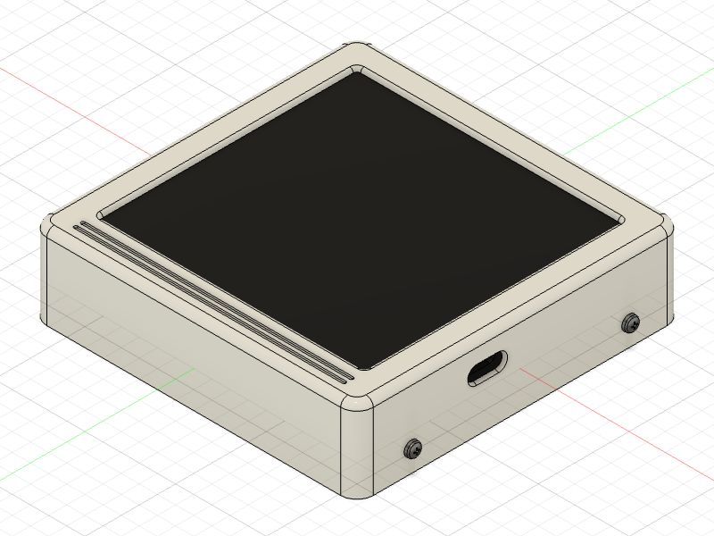
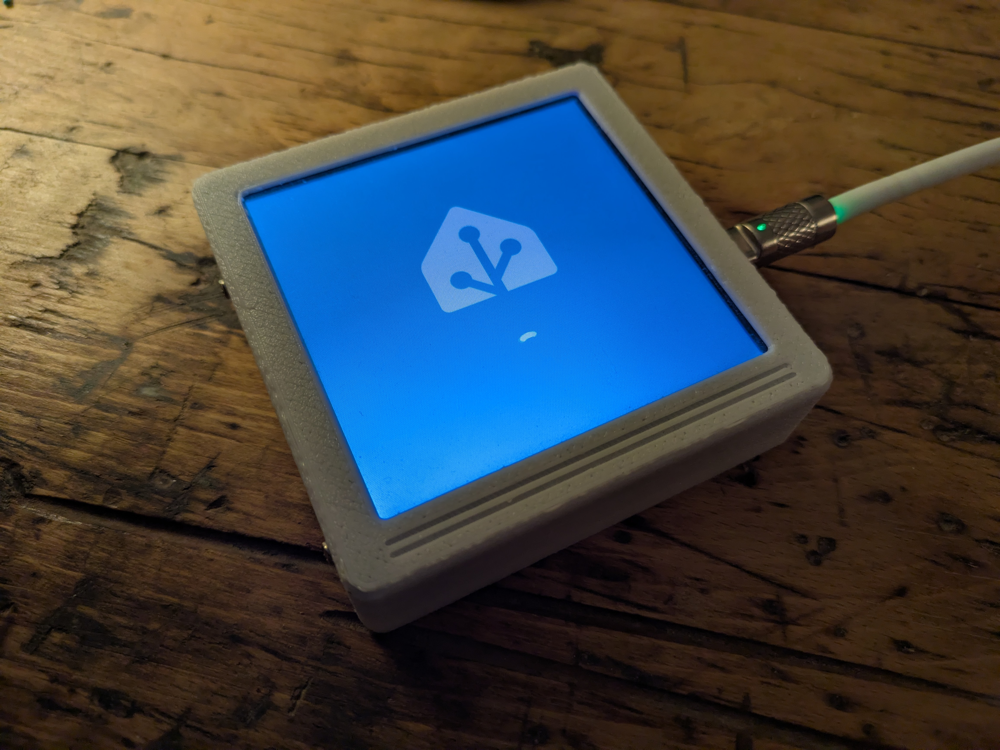
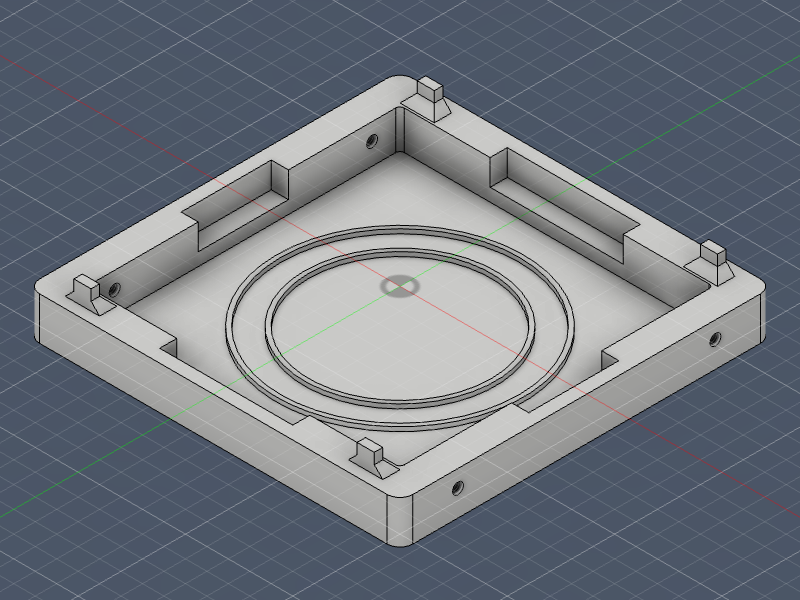
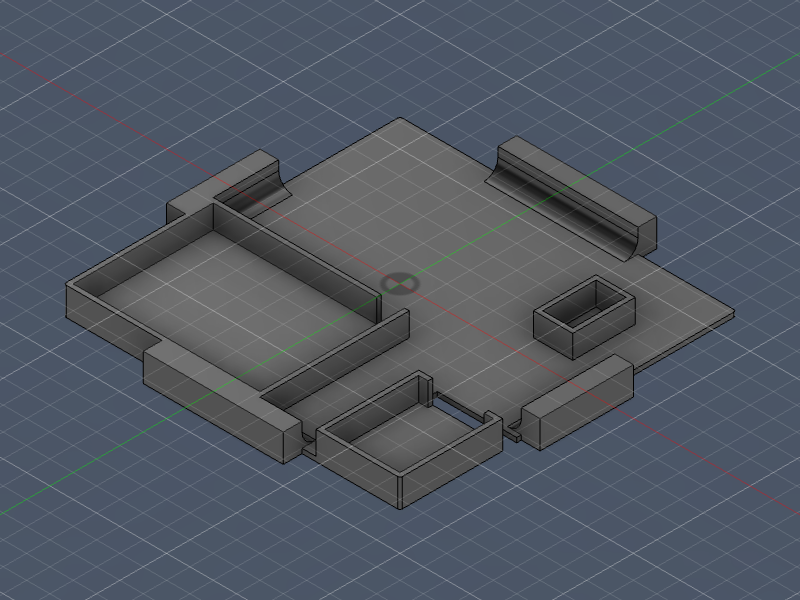
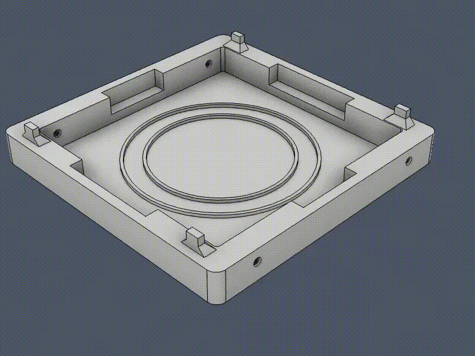

# Wireless Smart Home Control Panel

A mobile control panel with LCD touchscreen for smart home operation. Conveniently wireless rechargeable via Qi and magnetically centered with Magsafe. Can be used, for example, with Home Assistant via ESPHome.

## Overview

| Example 1 | Example 2 |
| --------- | --------- |
|  |  |

## 3D-Printed Parts

See the `print/stl/` and `print/png/` folders for all printable parts and preview images.

| Filename                  | Thumbnail                                                        | Required | Notes |
| ------------------------- | ----------------------------------------------------------------| -------- | ----- |
| `./print/lower_part.stl`  |  | 1        |       |
| `./print/middle_part.stl` |  | 1        |       |
| `./print/upper_part.stl`  |  | 1        |       |

## Standard Hardware

- Wireless charging coil: https://de.aliexpress.com/item/1005005909809714.html
- Magsafe ring: https://de.aliexpress.com/item/1005006588934001.html
- LiPo battery 3.7V, 500mAh: https://de.aliexpress.com/item/1005006646150179.html
- LCD panel with touchscreen: https://de.aliexpress.com/item/1005006622809642.html
- 4 sheet metal screws, 8 mm

## Assembly

- Glue the Magsafe ring and charging coil into the lower part. 
- Route the cables through the opening in the middle part and place the middle part onto the lower part. 
- Glue the LiPo battery into the middle part, solder it to the charging controller, and also solder the charging coil cables. 
- Connect the display to the charging controller and place it on top. 
- Finally, place the upper part over the display and fasten it to the lower part using the sheet metal screws.

## Usage

The display can be used for various applications. Below are some examples:

### Home assistant control panel

This example integrates the display with Home Assistant using ESPHome.

#### Prerequisites

- home assistant
- ESP home

#### Installation

1. Register the ESP32 with ESPHome (e.g., via ESPHome Web).
2. Rename the device to matrix-display (so that `display-terminal-upper.yaml` is the .yaml of your ESP home configuration for the device)
3. Copy the contents of [./ha_scripts](././ha_scripts) to the folder `[homeassistant]/config/esphome`, replacing `display-terminal-upper.yaml` 
4. Open `display-terminal-upper.yaml` in ESPHome and upload the configuration to the device.
5. Once installed, the device will appear in Home Assistant. Set up the device giving it a name and you are ready to go. 

#### Usage

The scripts are a minimal version of the terminal that I use myself (as shown in the photo) and are intended to demonstrate a modular and extensible YAML structure, as well as the code required to use the display with LVGL in ESPHome. All dependencies on my specific smart home setup have been removed, so they can be executed without needing the same sensor/entity configuration. However, the buttons are therefore not functional and only produce log outputs; you will need to adapt them to your own smart home.

## Development

Contributions are welcome!  
See `CONTRIBUTING.md` for details and follow the `CODE_OF_CONDUCT.md` when contributing.

All .stl, .png, and assembly pictures are automatically exported via my Fusion add-in, see [here](https://github.com/smengerl/fusion-exporter).

## License

This project is licensed under the Creative Commons Attribution-ShareAlike 4.0 International License (CC BY-SA 4.0) — see `LICENSE.txt` for details or visit http://creativecommons.org/licenses/by-sa/4.0/

## Authors

- Simon Gerlach <https://github.com/Smenger>

---

If something in this README is missing or unclear, please open an issue in the repository so the instructions can be improved.
