# Wireless Smart Home Control Panel

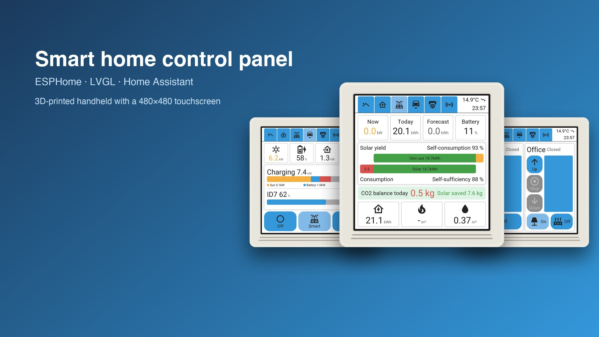

A 3D-printed, battery-powered 4″ touchscreen (480×480) for Home Assistant, built with ESPHome and LVGL. It charges wirelessly via Qi and snaps onto its charger with a MagSafe-compatible magnetic ring.

## Table of Contents
- [Design](#design)
- [Examples](#examples)
- [3D-Printed Parts](#3d-printed-parts)
- [Standard Hardware](#standard-hardware)
- [Assembly](#assembly)
- [Software](#software)
- [Development](#development)
- [License](#license)
- [Authors](#authors)

## Design

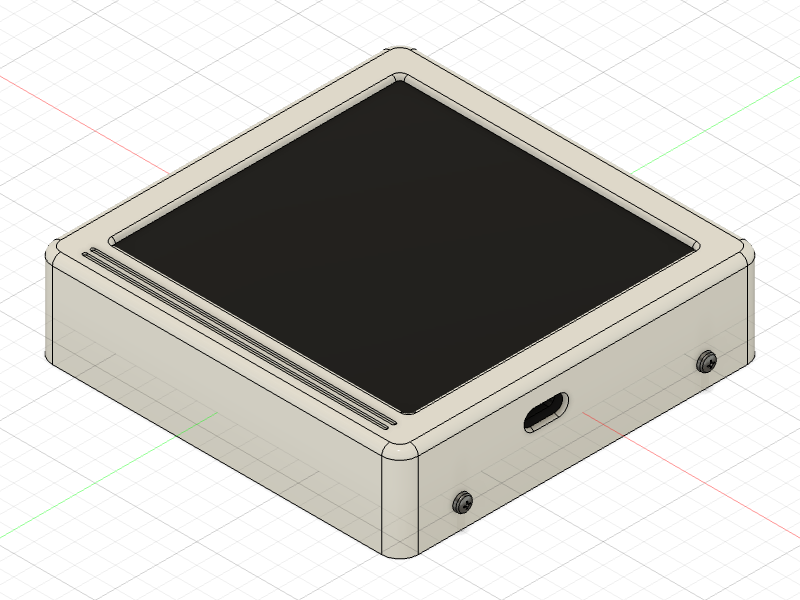

## Examples

Some of the pages I use on my own panels (ESPHome + LVGL, 480×480 px). The images are clean renderings of the real screens, drawn from the actual layout and design tokens.

| | | |
| :---: | :---: | :---: |
| 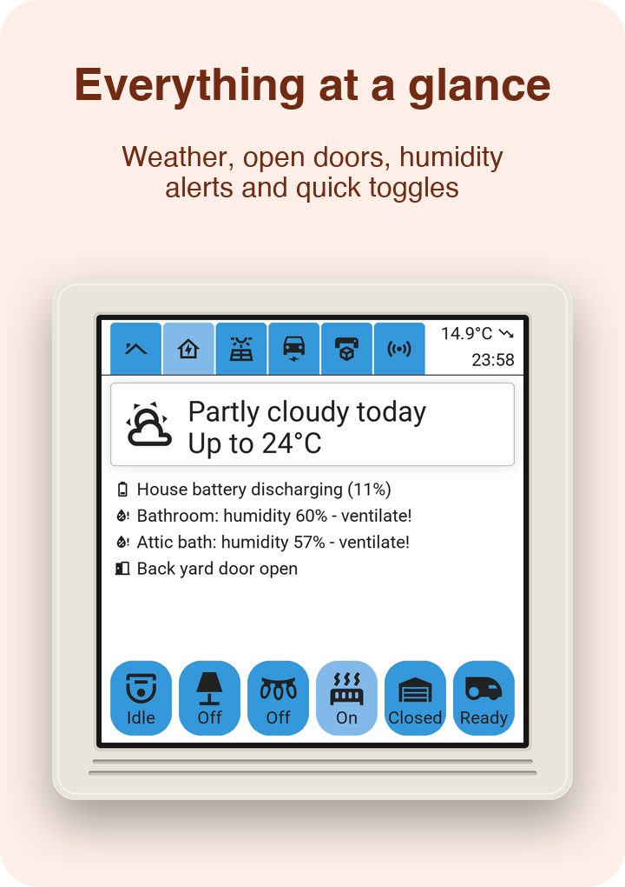 | 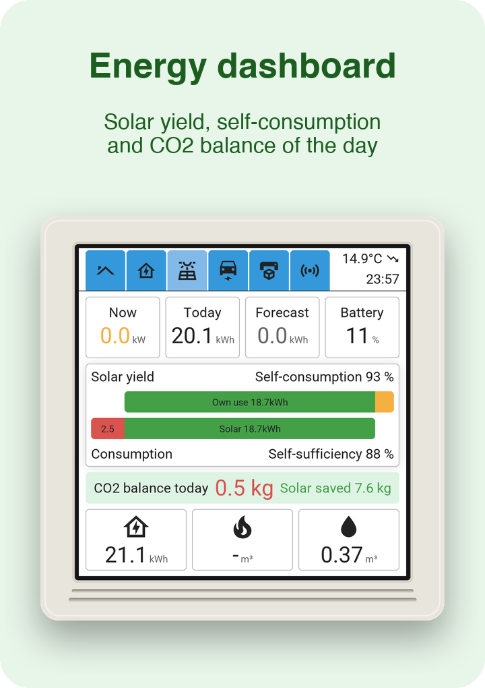 | 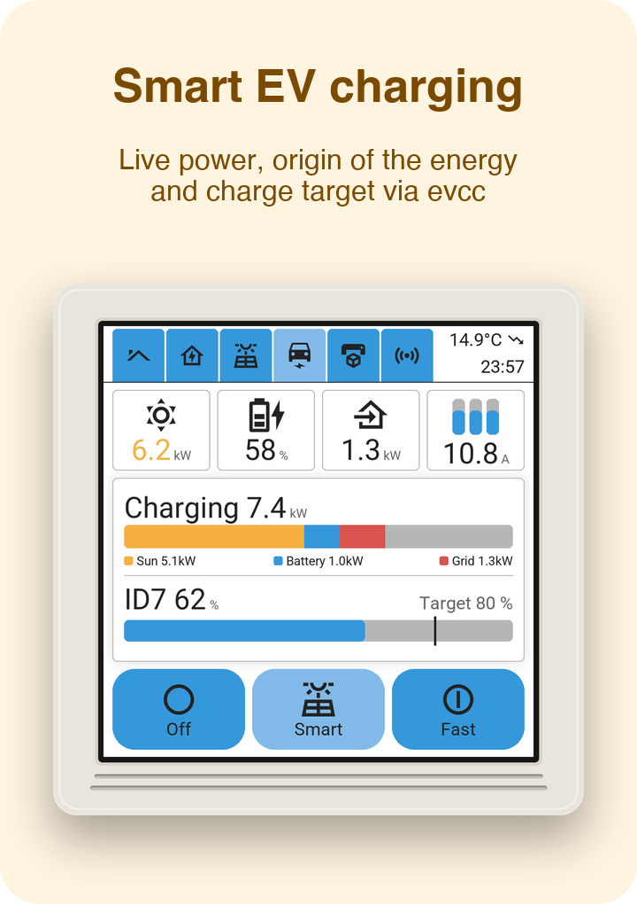 |
| 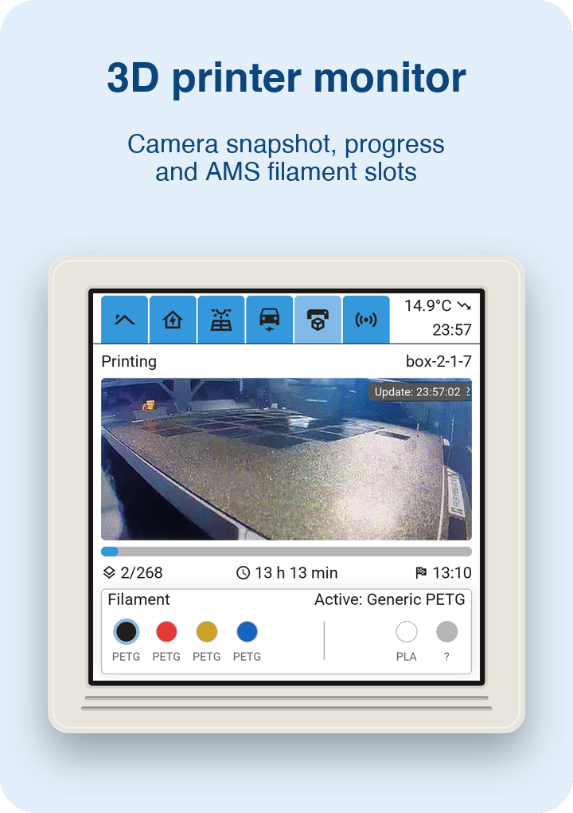 | 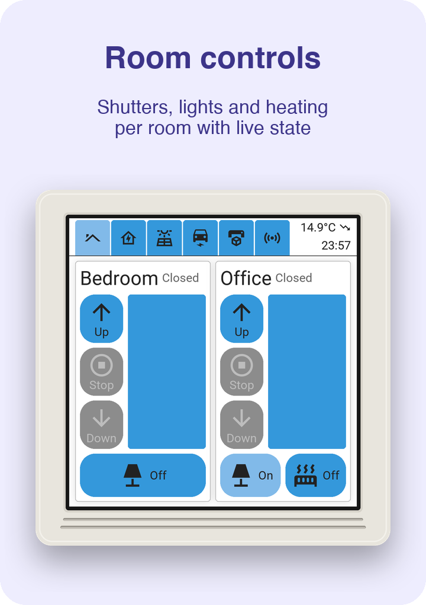 | 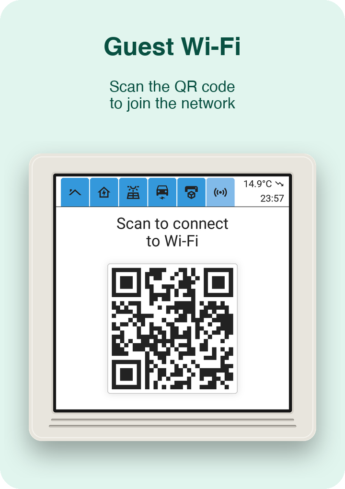 |
| | 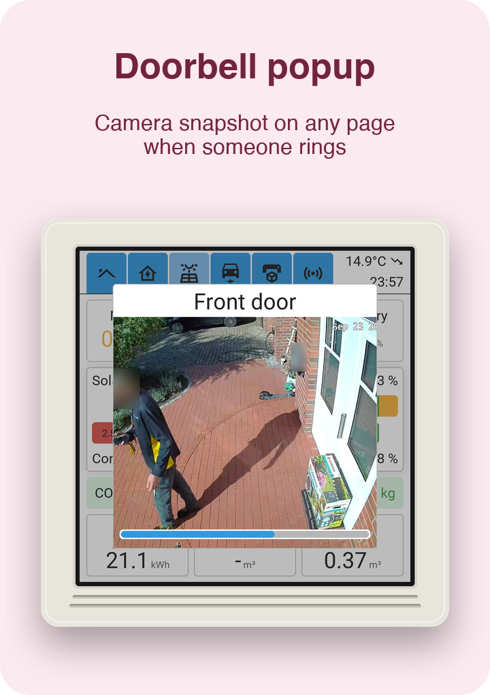 | |

The example configuration in [`ha_scripts`](./ha_scripts) contains the room-controls page in exactly this design, together with the header, icon tab bar and design tokens, without any dependency on my setup. The other pages depend on specific integrations (solar inverter, [evcc](https://evcc.io), Bambu Lab printer, doorbell camera) and are shown here as inspiration.

## 3D-Printed Parts

See the `print/stl/` and `print/png/` folders for all printable parts and preview images.

Print settings: PETG, 0.2 mm layer height, no supports.

| Filename                  | Thumbnail                                                        | Required | Notes |
| ------------------------- | ----------------------------------------------------------------| -------- | ----- |
| `./print/stl/lower_part.stl`  | 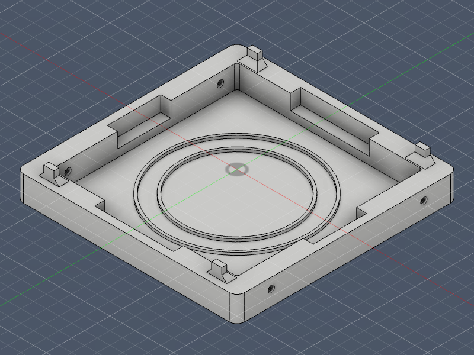 | 1        |       |
| `./print/stl/middle_part.stl` | 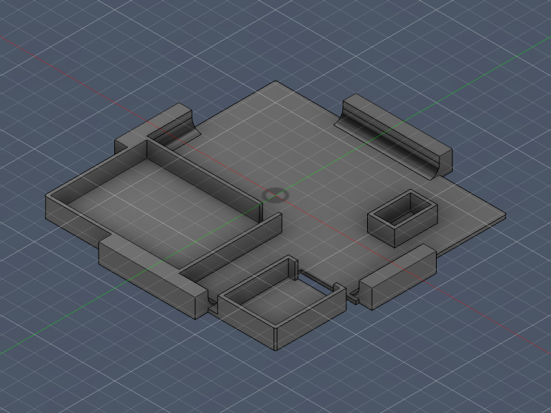 | 1        |       |
| `./print/stl/upper_part.stl`  | 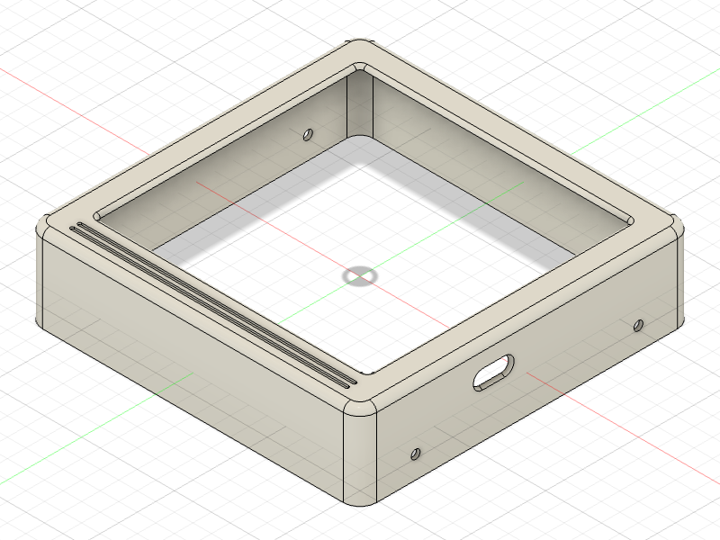 | 1        |       |

## Standard Hardware

- Display: Guition ESP32-S3-4848S040 — 4″ IPS, 480×480, ST7701S display driver, GT911 touch, ESP32-S3 on board: https://de.aliexpress.com/item/1005006622809642.html
- Qi wireless charging receiver with integrated charge controller: https://de.aliexpress.com/item/1005005909809714.html
- MagSafe-compatible magnetic ring: https://de.aliexpress.com/item/1005006588934001.html
- LiPo battery 3.7 V, 500 mAh: https://de.aliexpress.com/item/1005006646150179.html
- 4 sheet metal screws, 8 mm

## Assembly

- Glue the magnetic ring and the charging coil into the lower part.
- Route the cables through the opening in the middle part and place the middle part onto the lower part.
- Glue the LiPo battery into the middle part and solder it and the charging coil to the charge controller of the Qi receiver.
- Connect the display to the charge controller and place it on top.
- Finally, place the upper part over the display and fasten it to the lower part using the sheet metal screws.

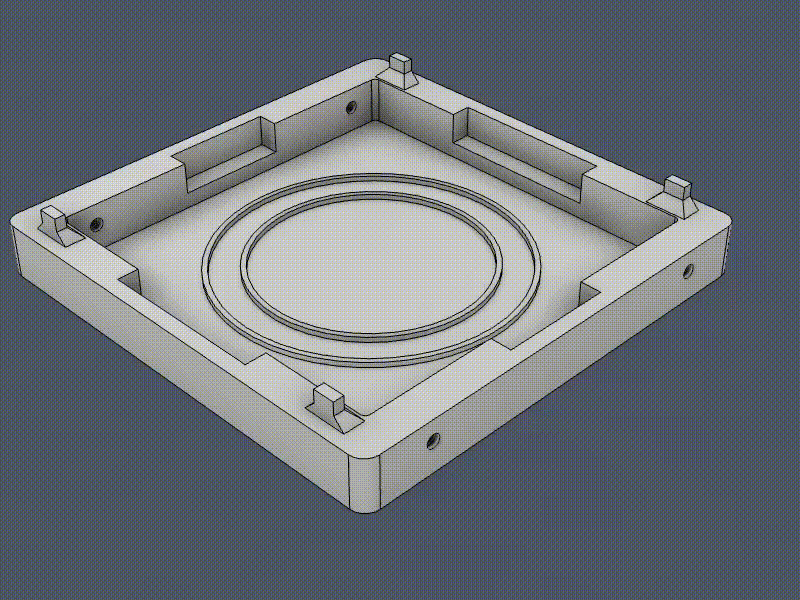

## Software

The panel can run anything the ESP32-S3 supports. This repository contains an example for Home Assistant with ESPHome and LVGL.

### Prerequisites

- [Home Assistant](https://www.home-assistant.io)
- [ESPHome](https://esphome.io) 2026.8.1 or newer, e.g. the ESPHome Device Builder add-on in Home Assistant

### Installation

1. In the ESPHome Device Builder, create a new device called `handheld-panel` (any name works, as long as the YAML file carries the same name).
2. Copy `handheld-panel.yaml` and the `handheld_panel` folder from [`ha_scripts`](./ha_scripts) into your ESPHome config folder (`[homeassistant]/config/esphome`) and replace the generated `handheld-panel.yaml` with it. Everything else lives inside `handheld_panel/`, so existing files of other devices are not touched.
3. Add the keys from [`secrets.yaml.example`](./ha_scripts/secrets.yaml.example) to your `secrets.yaml` in the same folder (append them if the file already exists) and fill in your own values.
4. Optional: set `outdoor_temperature_entity_id` in `handheld_panel/packages/statusbar.yaml` to a temperature sensor of yours. Without it the header shows `--°C`.
5. Install the configuration on the device from the Device Builder (the first time via USB).
6. Home Assistant discovers the device; add it and you are ready to go.

### What the example does

The example is a minimal version of the panel I use myself. It demonstrates:

- a modular, extensible YAML structure (one package per page, shared base packages)
- design tokens: colors, sizes and fonts are defined in one place (`colors_themes_*.yaml`, `standard_fonts.yaml`); pages only use tokens and a few shared styles
- a header with icon tabs, outdoor temperature and clock, plus screen dimming, a splash screen and an offline overlay
- the room-controls page shown above

It has no dependencies on a specific smart home, so it compiles and runs without matching entities. The shutter buttons only write log lines and the switches toggle locally; the comments in `page_room_controls.yaml` show how to call Home Assistant instead.

## Development

Contributions are welcome!
See `CONTRIBUTING.md` for details and follow the `CODE_OF_CONDUCT.md` when contributing.

All .stl, .png, and assembly pictures are automatically exported via my Fusion add-in, see [here](https://github.com/smengerl/fusion-exporter).

## License

This project is licensed under the Creative Commons Attribution-ShareAlike 4.0 International License (CC BY-SA 4.0) — see `LICENSE.txt` for details or visit http://creativecommons.org/licenses/by-sa/4.0/

## Authors

- Simon Gerlach <https://github.com/Smengerl>

---

If something in this README is missing or unclear, please open an issue in the repository so the instructions can be improved.
